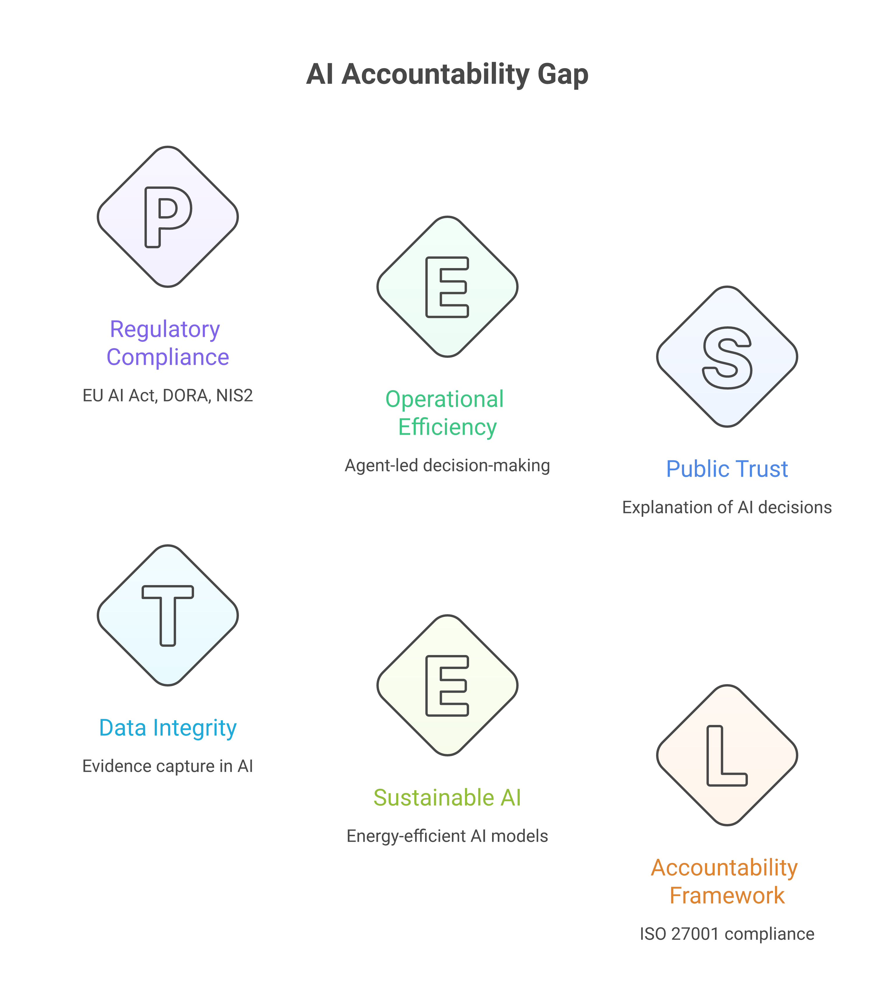
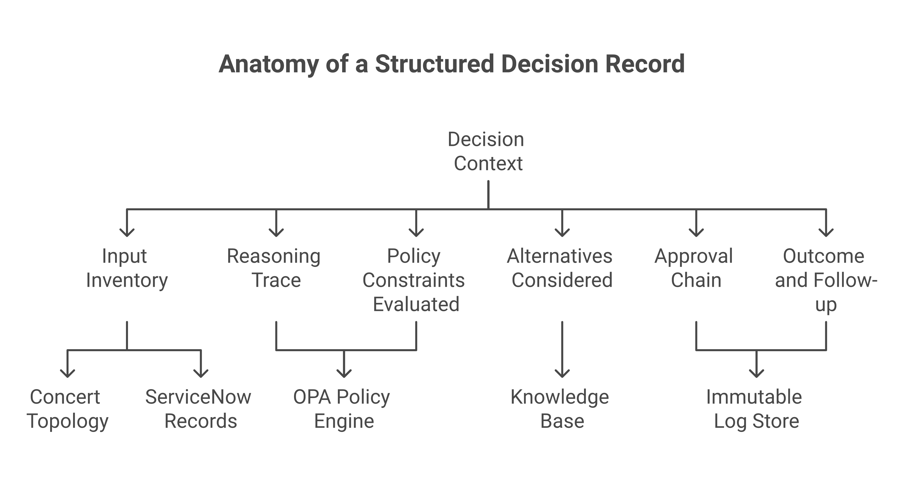
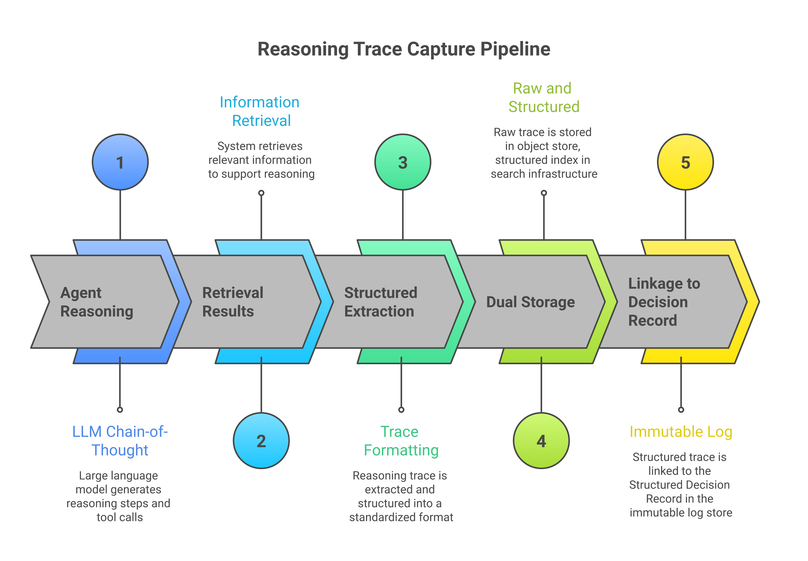
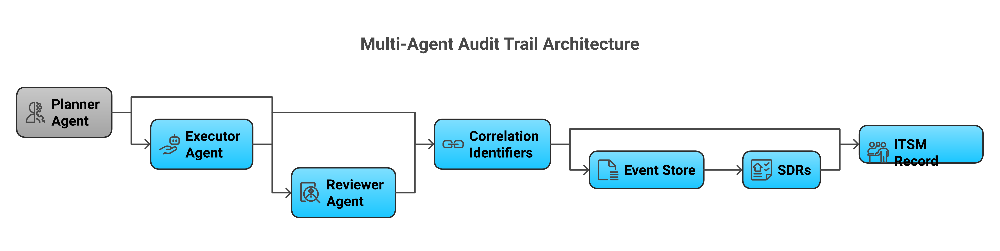
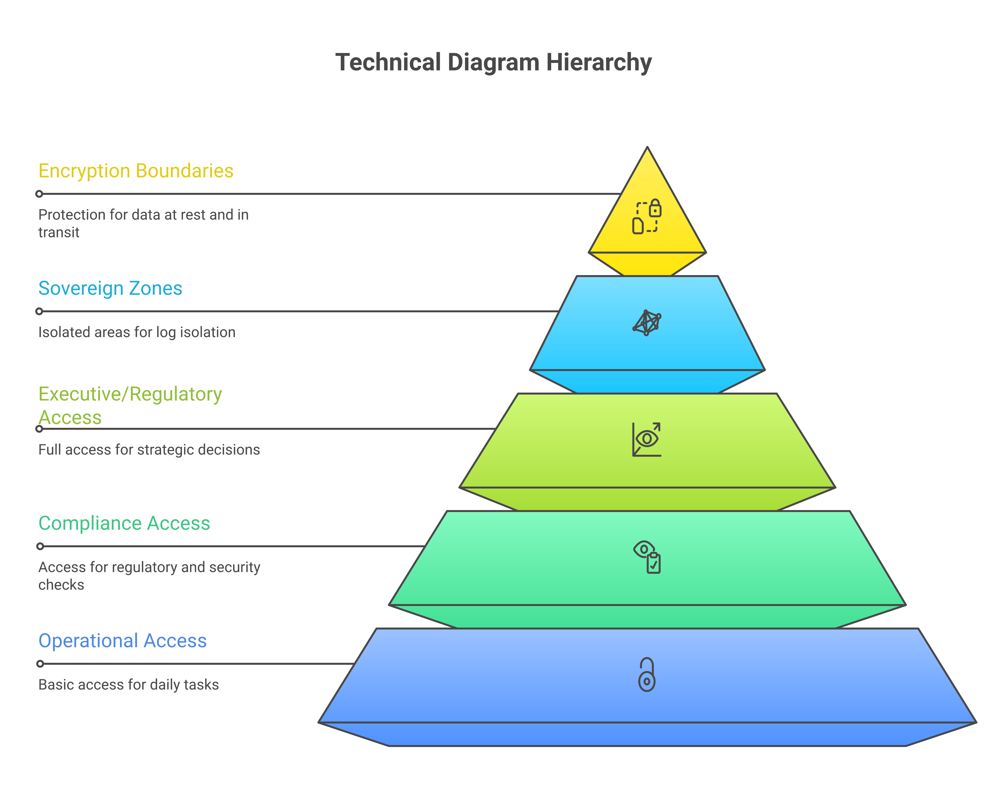

# Chapter 23 — Explainability and Auditability of Agentic Decisions

***

## Summary

This chapter addresses the operational requirement that every significant decision made by an AI agent must be explainable to human overseers and auditable after the fact, treating "the agent did it" as an unacceptable explanation under DORA, NIS2, and the EU AI Act. It defines three levels of explainability—model, agent, and system—and introduces the Structured Decision Record as the core provenance artefact capturing inputs, reasoning, alternatives considered, policy evaluations, approvals, and outcomes for every material agent action. The chapter examines chain-of-thought logging with configurable verbosity, multi-agent audit trail design using correlation identifiers and event-sourced persistence, and decision reconstruction tools including timeline views, decision tree visualisations, and counterfactual analysis. Architects will find guidance on balancing transparency with security through tiered access controls, code-defined redaction policies, sovereign-zone log isolation, and encryption of decision provenance data.

***

## 23.1 The explainability imperative in regulated operations

When an experienced engineer restarts a degraded service at two o'clock in the morning, the post-incident review can ask that engineer why they chose that action over the alternatives, what evidence they consulted, what risks they weighed, and what they expected to happen. The engineer may give an imperfect answer — memory is fallible, stress compresses reasoning, and the retrospective narrative inevitably smooths over the actual uncertainty of the moment — but the answer exists. There is a person who can be questioned, and the questioning itself is a governance act: it establishes accountability, surfaces learning, and provides the audit record that regulators expect.

When an AI agent restarts the same service, acting on a Concert situation event and reasoning through a chain of retrieval-augmented prompts, tool calls, and policy evaluations, the same questions apply with even greater force. Why did the agent choose this action? What inputs did it consult? What alternatives did it consider and reject? What constraints did it evaluate? The answers to these questions are not optional; they are a regulatory obligation in every jurisdiction where the organisation operates critical infrastructure. "The agent did it" is not an acceptable answer to any of these questions. It is the agentic equivalent of "it just happened," and it will satisfy neither a regulator conducting a supervisory examination nor an internal auditor assessing the adequacy of the organisation's control framework.

The regulatory landscape makes this expectation explicit. The EU AI Act, which entered into force in August 2024 and whose provisions are being phased in through 2027, imposes transparency obligations on providers and deployers of AI systems. Article 13 requires that high-risk AI systems be designed and developed in such a way that their operation is sufficiently transparent to enable deployers to interpret the system's output and use it appropriately [1]. Article 14 further requires that high-risk AI systems be designed to allow effective human oversight, including the ability for human overseers to understand the system's capabilities and limitations, to correctly interpret its outputs, and to decide not to use the system or to override its decisions. For organisations deploying agentic AI in operational contexts — incident remediation, change execution, security response — these articles are not abstract policy aspirations. They are concrete design requirements that must be satisfied before the system enters production.

The Digital Operational Resilience Act (DORA), applicable to financial entities across the European Union from January 2025, does not use the word "explainability" but creates obligations that are functionally equivalent [2]. Article 6 requires financial entities to develop ICT risk management frameworks that include mechanisms for the detection of anomalous activities and the identification of single points of failure. Article 17 requires that incident management processes include procedures for identifying the root causes of incidents and assessing whether those root causes might also affect other processes or services. When the operational activity being investigated was performed by an AI agent, satisfying these requirements demands that the agent's reasoning and decision process be reconstructable after the fact. A financial entity that cannot explain why its automated systems took a particular action during an incident is a financial entity that cannot demonstrate adequate ICT risk management.

NIS2, the revised Directive on Security of Network and Information Systems, extends comparable obligations to essential and important entities across critical sectors including energy, transport, health, and digital infrastructure [3]. Its requirements for incident reporting, risk management, and supply chain security all presuppose that the organisation can account for the actions taken by its systems — including AI systems — during and after security events. The directive's emphasis on management body accountability (Article 20) means that senior leadership cannot delegate awareness of how AI agents operate to a technical team and consider the obligation discharged. They must be able to understand, at an appropriate level of abstraction, what the agents do and why.

Beyond the specific regulatory instruments, there is a broader governance principle at stake. The accountability gap — the space between "a decision was made" and "here is who made it, why, and on what basis" — is the central risk of agentic operations at scale. Every chapter in this book that describes agents taking operational actions, from incident remediation in [Chapter 19](19_chapter_itsm_multi_agent_workflows.html) to change execution in [Chapter 11](11_chapter_infrastructure_as_code.html) to security response in [Chapter 13](13_chapter_secrets_identity_access.html), implicitly depends on the assumption that those actions can be explained and audited. This chapter makes that assumption explicit and provides the architectural patterns for satisfying it.

***

## 23.2 Levels of explainability for operational agents

Explainability is not a single capability; it is a spectrum. Different stakeholders require different levels of explanation, and different technical mechanisms produce different kinds of transparency. A regulator asking "why did your system take this action during the incident?" needs a different answer from an ML engineer asking "which features drove this model's prediction?" and both need a different answer from an auditor asking "can you demonstrate that this decision was consistent with your documented policies?" Designing for explainability requires clarity about which levels are needed and for whom.

The first level is **model-level explainability**: understanding the internal reasoning of the machine learning model or large language model that underpins the agent's decisions. For traditional supervised learning models — the kind used in anomaly detection, predictive maintenance, and risk scoring — established techniques such as SHAP (SHapley Additive exPlanations) values, LIME (Local Interpretable Model-agnostic Explanations), and attention-weight visualisation provide varying degrees of insight into which input features contributed most to a particular output [4]. SHAP values, grounded in cooperative game theory, offer a mathematically principled attribution of each feature's contribution to the model's output for a specific instance. For a model predicting that a particular deployment change is high-risk, SHAP values might reveal that the dominant contributing factors were the time of day, the number of dependent services currently in a degraded state, and the historical failure rate of similar changes — a level of explanation that is both technically rigorous and intuitively meaningful to an operations team.

For large language models — the foundation models that power the reasoning capabilities of agentic systems built on watsonx.ai and similar platforms — model-level explainability is more constrained. The internal representations of a transformer model with billions of parameters do not decompose neatly into human-interpretable feature attributions. Attention-weight analysis can indicate which tokens in the input the model attended to most heavily when generating a particular output, but the relationship between attention and causal reasoning is complex and contested in the research literature [5]. Model-level explainability for LLMs is an active area of research, but it is not, at present, a practical foundation for the kind of operational explainability that regulators require.

The second level is **agent-level explainability**: understanding the reasoning process of the agent as a whole, including its chain-of-thought, its tool-call sequence, its retrieval results, and its policy evaluations. This is the level at which most practical operational explainability is achieved. When an agent reasons through a problem — "I observed elevated error rates on the payment service; I queried Concert's topology to identify upstream dependencies; I retrieved the relevant runbook from the knowledge base; I evaluated the proposed restart against the OPA policy governing payment-service actions; the policy permitted the action; I executed the restart" — the chain of reasoning, if captured, provides a coherent explanation of the agent's behaviour that is accessible to human reviewers and auditors without requiring them to understand the model's internal weights.

The third level is **system-level explainability**: understanding how the broader system of agents, tools, policies, and human oversight mechanisms produced the observed outcome. In a multi-agent architecture such as the one described in [Chapter 18](18_chapter_multi_agent_orchestration.html), a single operational decision may involve a planner agent that decomposed a problem, multiple executor agents that investigated different hypotheses in parallel, a reviewer agent that evaluated the proposed action against policy, and a human approver who authorised the final execution. System-level explainability captures the workflow provenance: which agents participated, in what sequence, with what inputs and outputs, under what policies, and with what human oversight. This is the level that regulators most frequently need, because it answers the question they actually care about: "Was this action taken under appropriate governance, and can you prove it?"

For regulated operational environments, the pragmatic recommendation is to invest most heavily in agent-level and system-level explainability, where the return on investment is highest and the regulatory requirements are most directly satisfied. Model-level explainability remains important for the data science teams responsible for model development and validation — and watsonx.governance provides the tooling for tracking model performance, bias metrics, and drift indicators that support this level of scrutiny [6] — but it is not the layer at which operational auditors and regulators typically engage.

The distinction between these levels also maps to the EU AI Act's requirements. Article 13's transparency obligations are primarily concerned with what this chapter calls agent-level and system-level explainability: the deployer must be able to interpret the system's output and understand its operation well enough to exercise meaningful oversight [1]. Article 11's requirement for technical documentation encompasses all three levels, requiring that the documentation describe the system's design specifications, development methodology, and the logic involved in its decision-making.

***

## 23.3 Decision provenance architecture

If explainability is the ability to answer "why did the agent do this?", then decision provenance is the infrastructure that makes the answer possible. Provenance, in the data governance sense, is the documented history of an artefact: where it came from, how it was transformed, and what processes acted upon it. Decision provenance extends this concept to operational decisions: for every action an agent takes, the system must capture and retain a structured record of the inputs that informed the decision, the reasoning that was applied, the alternatives that were considered, the constraints that were evaluated, and the outcome that resulted.

The architectural pattern for decision provenance centres on the **Structured Decision Record** (SDR), a machine-readable document generated by the agent at the point of decision and persisted to an immutable store. The SDR is not a log entry; it is a first-class operational artefact with a defined schema, mandatory fields, and explicit relationships to other operational records. A well-designed SDR contains the following elements.

**Decision context** captures the circumstances that triggered the decision. For an incident remediation decision, this includes the Concert situation identifier, the affected services and their topology relationships, the current health posture of the estate, and the time elapsed since the situation was detected. The context establishes the "why now" of the decision — the operational conditions that made the decision necessary.

**Input inventory** enumerates every information source the agent consulted in reaching its decision. This includes telemetry data retrieved from Instana or other monitoring systems, topology information from Concert's knowledge graph, runbooks and knowledge base articles retrieved through RAG (as described in [Chapter 20](20_chapter_kb_augmented_operations.html)), historical incident records from ServiceNow, and any other data sources the agent queried. Each input is recorded with a reference identifier, a timestamp indicating when it was retrieved, and a summary of the relevant content. The input inventory answers the question "what did the agent know?" — a question that is essential for evaluating whether the decision was reasonable given the available information.

**Reasoning trace** captures the agent's chain-of-thought: the sequence of logical steps through which the agent moved from the observed situation to the proposed action. Section 23.4 discusses the practical implementation of reasoning trace capture in detail. For the SDR, the key requirement is that the reasoning trace be included by reference (if stored separately) or by value (if sufficiently compact), and that it be indexed in a way that allows an auditor to follow the agent's reasoning step by step.

**Alternatives considered** documents the options the agent evaluated and rejected. This is one of the most important elements of the SDR for auditability purposes, because it demonstrates that the agent's decision was not arbitrary — it was the result of a comparative evaluation. For an incident remediation decision, the alternatives might include "restart the service," "scale the service horizontally," "roll back the most recent deployment," and "escalate to a human operator." For each alternative, the SDR records why it was considered and why it was accepted or rejected. An agent that considered rolling back a deployment but rejected it because the rollback target version had a known vulnerability documented in the knowledge base has demonstrated a quality of reasoning that an auditor can evaluate and, importantly, that a human operator can learn from.

**Policy constraints evaluated** records the policy checks that the agent performed against the Open Policy Agent (OPA) guardrail layer or equivalent policy engine. For each policy, the SDR records the policy identifier, the version evaluated, the input data provided to the policy, and the evaluation result (permit, deny, or conditional). This element establishes that the agent's action was consistent with the organisation's documented policies — a requirement that maps directly to ISO 27001's expectation that changes to information processing systems be managed in accordance with documented procedures [7].

**Approval chain** captures the human oversight that was applied to the decision, if any. For actions within the agent's autonomous authority, the approval chain records the policy that grants that authority. For actions requiring human approval, it records the approver's identity, the timestamp of approval, and the scope of the approval. This element closes the accountability loop: it links the agent's proposed action to the human authorisation that permitted it.

**Outcome and follow-up** records what actually happened when the decision was executed: whether the action succeeded, what the post-action state of the affected systems was, whether any unexpected side-effects were observed, and what follow-up actions were triggered. This element enables retrospective evaluation: did the agent's decision produce the expected result? If not, what can be learned?

The SDR schema should be versioned and governed as an organisational standard, with the same rigour applied to policy-as-code artefacts. Changes to the schema — adding mandatory fields, modifying the structure of the alternatives record, extending the policy evaluation format — should be managed through the same change enablement process described in [Chapter 19](19_chapter_itsm_multi_agent_workflows.html), because a change to the SDR schema affects the evidentiary basis of every future agent decision.

Storage of SDRs must satisfy two requirements simultaneously: immutability and queryability. Immutability ensures that SDRs cannot be altered after creation, which is essential for their evidentiary value. Queryability ensures that auditors, investigators, and automated compliance tools can search, filter, and retrieve SDRs efficiently. Append-only data stores — such as Amazon QLDB, Azure Confidential Ledger, or purpose-built immutable object storage with cryptographic verification — provide the immutability guarantee. Indexing layers built on top of the immutable store provide the query capability. In a sovereign operations context, the storage location of SDRs must respect the same data residency constraints that apply to other operational data: decisions about EU-regulated services must be stored in EU-resident infrastructure, and the SDR store's access controls must reflect the organisation's sovereign zone model.

Concert's topology graph provides the natural integration point for SDRs within the broader operational architecture. Each SDR references Concert entities — services, applications, deployments, infrastructure components — by their topology identifiers. This means that an operator viewing a service in Concert's topology view can navigate directly to the decision records associated with that service: every agent decision that affected it, every remediation that was applied to it, every change that was made to it. The topology graph becomes not only a view of the estate's current state but a navigable index into the estate's decision history.

***

## 23.4 Chain-of-thought logging and reasoning traces

The reasoning trace — the chain-of-thought through which an agent moves from observation to action — is the most granular and, for many audit purposes, the most valuable component of the decision provenance record. It is also the most technically challenging to capture well. Too little detail and the trace is useless for reconstruction; too much detail and the trace becomes an impenetrable wall of text that no auditor will read and no indexing system can meaningfully process. The architecture of reasoning trace capture must balance fidelity with utility.

Modern large language models, including the foundation models available through watsonx.ai, can be prompted to generate explicit chain-of-thought reasoning: step-by-step articulations of their logic as they work through a problem. This capability, first demonstrated systematically by Wei and colleagues in 2022 [8], has become a standard technique in agentic AI systems, where explicit reasoning improves both the quality of the model's decisions and the transparency of its process. For operational agents, chain-of-thought prompting serves a dual purpose: it improves the agent's reasoning quality (by forcing explicit logical steps rather than implicit pattern matching) and it produces a natural-language reasoning trace that can be captured, stored, and reviewed.

The practical implementation of reasoning trace capture involves several architectural decisions.

**Structured versus unstructured traces.** A raw chain-of-thought output from an LLM is unstructured natural language: "I see that the payment service has elevated error rates. Let me check the upstream dependencies. The card-network-adapter shows normal latency. The database connection pool is at 95% utilisation, which is above the 85% threshold documented in the runbook. I will recommend scaling the connection pool." This narrative is readable but difficult to index, search, or process programmatically. A structured trace reformats the same reasoning into a sequence of typed steps: observation (elevated error rates on payment-service), investigation (queried upstream dependencies via Concert topology), finding (card-network-adapter normal; database connection pool at 95%, threshold 85%), retrieval (runbook R-PAY-042 section 3.2), decision (scale connection pool), policy check (OPA policy change-db-config: PERMIT). The structured format enables programmatic processing while preserving the logical narrative. The recommended approach is to capture both: the raw LLM output for human review and the structured extraction for indexing and automated analysis.

**Tool-call sequences.** In agentic architectures, reasoning is not purely linguistic; it involves tool calls — API invocations, database queries, retrieval operations, policy evaluations — that produce concrete outputs which inform subsequent reasoning steps. The reasoning trace must capture not only the LLM's textual reasoning but also the full tool-call sequence: which tool was called, with what parameters, at what time, and what result was returned. This is the mechanistic backbone of the agent's reasoning: without the tool-call record, the chain-of-thought is an unsupported narrative rather than a grounded account of what the agent actually did.

The tool-call sequence also provides the basis for **reproducibility testing**: given the same inputs and tool-call results, would the agent reach the same conclusion? While LLM outputs are inherently non-deterministic (unless temperature is set to zero, which is impractical for most operational reasoning), the structured inputs and tool-call results are deterministic. An auditor can examine whether the tool-call results, taken together, reasonably support the agent's conclusion — even if the exact wording of the conclusion might vary across repeated executions.

**Retrieval results.** When an agent uses retrieval-augmented generation (as described in [Chapter 20](20_chapter_kb_augmented_operations.html)) to consult the knowledge base, the specific passages retrieved and their relevance scores must be captured as part of the reasoning trace. This is essential for two reasons. First, it allows an auditor to verify that the agent's reasoning was grounded in relevant, current knowledge rather than hallucinated content. Second, it enables the identification of knowledge gaps: if an agent made a suboptimal decision because the relevant runbook was not in the knowledge base, or because the retrieved passage was outdated, that gap can be identified and remediated. The retrieval record should include the query submitted to the vector store, the documents returned with their similarity scores, and the specific passages that were injected into the agent's context window.

**Retention and storage.** Reasoning traces are verbose. A single agent decision involving multiple tool calls, retrieval operations, and reasoning steps can generate tens of kilobytes of structured trace data. For an organisation processing thousands of agent decisions per day, the cumulative storage requirement is substantial but manageable with modern object storage infrastructure. The retention policy for reasoning traces should be aligned with the organisation's regulatory obligations: DORA requires that ICT-related incident records be retained for at least five years [2], and reasoning traces associated with incident-related decisions should follow the same retention schedule. For non-incident decisions, a shorter retention period — twelve to twenty-four months — may be appropriate, subject to the organisation's own risk appetite and audit cycle.

**Indexing and search.** Raw reasoning traces, even in structured form, are useful only if they can be found when needed. The indexing strategy should support queries by decision type (incident remediation, change execution, security response), by affected service (using Concert topology identifiers), by time range, by agent identity, by policy evaluated, and by outcome (success, failure, escalation). Full-text search over the natural-language components of the trace enables more exploratory queries — "find all decisions where the agent mentioned connection pool saturation" — that support trend analysis and proactive problem management.

**Verbosity control.** Not every agent decision warrants the same level of trace detail. A routine service health check that confirms normal operation does not need the same trace depth as a P1 incident remediation that involves a database failover. The architecture should support configurable verbosity levels — minimal, standard, and detailed — with the level determined by the decision's risk classification. Decisions affecting tier-one regulated services, decisions involving actions outside pre-approved standard change models, and decisions taken during active incidents should default to detailed tracing. Routine monitoring decisions can use minimal tracing. The verbosity level itself should be recorded in the SDR, so that an auditor reviewing a minimal trace knows that the reduction in detail was a deliberate policy choice rather than a system failure.

***

## 23.5 Audit trail design for multi-agent systems

The challenges of explainability and auditability intensify when multiple agents collaborate on a single operational task. [Chapter 18](18_chapter_multi_agent_orchestration.html) described the multi-agent orchestration architecture in which planner agents decompose problems, executor agents perform specialised investigations and actions, and reviewer agents evaluate proposed actions against policy. [Chapter 19](19_chapter_itsm_multi_agent_workflows.html) showed how this architecture integrates with ITSM workflows. The question this section addresses is how to maintain a coherent, tamper-evident audit trail across the boundaries of multiple collaborating agents, so that the full provenance of a multi-agent decision can be reconstructed as a single narrative rather than a collection of disconnected fragments.

The foundational design pattern is **correlation through shared identifiers**. Every multi-agent workflow is assigned a unique workflow correlation identifier at the point of initiation. This identifier — analogous to a distributed tracing span ID in the OpenTelemetry model — propagates through every agent interaction within the workflow. When a planner agent dispatches a sub-task to an executor agent, the sub-task inherits the workflow correlation identifier and adds its own sub-task identifier. When the executor agent makes tool calls, retrieves knowledge, or evaluates policies, each of those actions is tagged with both the workflow correlation identifier and the sub-task identifier. The result is a hierarchical trace structure that can be navigated at multiple levels of granularity: from the workflow as a whole, to individual sub-tasks, to specific agent actions within each sub-task.

This pattern is not novel; it is a direct application of the distributed tracing principles codified in the W3C Trace Context specification [9] and implemented by OpenTelemetry. What is distinctive in the agentic context is that the "services" being traced are not microservices handling HTTP requests but AI agents handling reasoning tasks. The span boundaries are not network calls but agent interactions: the planner dispatching to the executor, the executor calling a tool, the reviewer evaluating a policy. The adaptation requires that the agent orchestration framework — watsonx Orchestrate or its equivalent — propagate trace context through its internal communication mechanisms with the same fidelity that a service mesh propagates trace context through HTTP headers.

**Event sourcing** provides the persistence model for the multi-agent audit trail. Rather than maintaining mutable state records that are updated as the workflow progresses, the system emits an immutable event for every significant state transition: workflow initiated, sub-task dispatched, tool called, result received, policy evaluated, decision proposed, approval requested, approval granted, action executed, outcome observed. Each event carries the workflow correlation identifier, the sub-task identifier (if applicable), the agent identity, a timestamp, and the event payload. The complete audit trail for any workflow is the ordered sequence of events sharing the same workflow correlation identifier. Because the events are immutable and append-only, the trail cannot be retroactively altered — a property that is essential for regulatory evidence.

The event sourcing approach also enables **temporal reconstruction**: given a workflow correlation identifier, an investigator can replay the sequence of events to understand exactly what happened, in what order, and with what information available at each step. This is more powerful than a static log, because it preserves the temporal dimension of the decision process. An agent that made a reasonable decision based on the information available at step three may appear to have made a poor decision when evaluated against information that only became available at step seven. Temporal reconstruction allows the investigator to evaluate each step in the context of its own moment, avoiding the hindsight bias that plagues post-incident analysis.

**Tamper evidence** is the property that any unauthorised modification of the audit trail is detectable. For regulatory evidence, this property is not merely desirable; it is often required. The simplest mechanism is cryptographic chaining: each event in the trail includes a hash of the previous event, creating a chain in which any modification to an earlier event invalidates the hashes of all subsequent events. More sophisticated approaches use Merkle trees or blockchain-inspired structures to provide efficient verification of trail integrity without requiring a sequential scan of the entire chain. The choice of mechanism depends on the organisation's threat model and regulatory requirements. For most operational audit trails, cryptographic chaining with periodic integrity verification by an independent process is sufficient.

**Cross-agent attribution** is the specific challenge of maintaining clear accountability when multiple agents participate in a decision. In a multi-agent remediation workflow, the question "who decided to restart the service?" does not have a simple answer: the planner agent identified the restart as a candidate action, the executor agent confirmed that the preconditions were met, the reviewer agent verified that the policy permitted it, and a human approver authorised the execution. Each of these contributions must be attributed distinctly in the audit trail, so that an investigator can determine which agent or person was responsible for each element of the decision. The SDR for a multi-agent decision should include a responsibility matrix that maps each element of the decision — problem identification, alternative generation, risk assessment, policy evaluation, approval, execution — to the specific agent or person that performed it.

The integration with ITSM records described in [Chapter 19](19_chapter_itsm_multi_agent_workflows.html) is critical here. The ServiceNow incident record, change record, or problem record serves as the human-readable summary of the multi-agent workflow, while the event-sourced audit trail in the immutable log store provides the detailed, machine-navigable provenance. The two are linked by the workflow correlation identifier, which is written into the ServiceNow record as a custom field. An auditor reviewing the ServiceNow record can navigate to the detailed audit trail; an investigator examining the audit trail can navigate to the ITSM record that provides the business context.

***

## 23.6 Querying and reconstructing agent decisions

The value of decision provenance and audit trails is realised only when they can be effectively queried and navigated. An immutable store containing millions of SDRs and billions of trace events is a compliance liability rather than a compliance asset if no one can find the relevant records when needed. This section addresses the tools and interfaces that make decision reconstruction practical.

**Timeline reconstruction** is the most fundamental query pattern. Given a service identifier and a time range, the system must be able to produce an ordered timeline of every agent decision that affected that service: what was decided, by which agent, in response to what situation, with what outcome. The timeline view is the auditor's primary navigation tool, because regulatory inquiries are almost always framed temporally: "Show us what happened to the payment processing service between 14:00 and 16:00 on 15 March." The timeline is constructed by querying the SDR index for records referencing the specified service within the specified time range, and ordering the results by decision timestamp. Each entry in the timeline links to the full SDR and, through it, to the reasoning trace and the multi-agent audit trail.

Concert's topology view provides a natural home for timeline integration. When an operator or auditor views a service in Concert's topology graph, a decision timeline panel can display the history of agent decisions affecting that service. This integration transforms Concert from a real-time operational view into a historical investigation tool: not only "what is the current state of this service?" but "what decisions have been made about this service, and what were their effects?" The topology context also enables impact-aware queries: "Show me all agent decisions that affected any service in the dependency chain upstream of the payment gateway during this time period." Such queries, which traverse Concert's dependency graph before querying the SDR index, are essential for investigating cascading failures where the root cause and the visible symptom are separated by multiple dependency hops.

**Decision tree visualisation** provides a structural view of a single complex decision. For a multi-agent workflow involving a planner, multiple executors, and a reviewer, the decision tree shows the decomposition of the problem into sub-tasks, the findings of each sub-task, the synthesis of findings into a proposed action, the policy evaluation, and the approval chain. The tree structure makes it immediately visible which branches of investigation contributed to the final decision and which were explored but found irrelevant. Decision tree visualisation is particularly valuable for post-incident reviews, where the team needs to understand not only what the agent did but how it arrived at that action through a potentially complex reasoning process.

**Counterfactual analysis** addresses the question "what would the agent have done if the circumstances had been different?" This is a more sophisticated capability, but it is increasingly important for regulatory compliance and for continuous improvement of agent behaviour. Counterfactual queries take several forms. "What would the agent have done if the runbook had included the updated procedure?" — a question that tests the sensitivity of the decision to knowledge base content. "What would the agent have done if the OPA policy had not permitted autonomous restarts?" — a question that tests the adequacy of policy constraints. "What would the agent have done if the database connection pool had been at 70% rather than 95%?" — a question that tests the sensitivity of the decision to input data.

Counterfactual analysis is implemented by replaying the agent's reasoning process with modified inputs. The original SDR provides the baseline: the actual inputs, the actual reasoning, the actual decision. The counterfactual scenario modifies one or more inputs and re-executes the reasoning chain (or a deterministic simulation of it) to observe whether the decision changes. This capability depends on the fidelity of the reasoning trace capture described in Section 23.4: the more completely the original inputs and tool-call results are recorded, the more accurately the counterfactual replay can simulate an alternative scenario.

The practical implementation of counterfactual analysis requires care. LLM reasoning is inherently non-deterministic, so replaying the same inputs will not necessarily produce the same output, let alone a modified input producing a predictable variation. The approach is therefore statistical rather than deterministic: run the counterfactual scenario multiple times and observe the distribution of outcomes. If the agent consistently makes the same decision regardless of the modified input, the decision is robust to that variation. If the agent's decision changes in a significant fraction of replays, the modified input is a sensitive factor that warrants attention. This approach is computationally expensive and is therefore reserved for significant decisions — P1 incident remediations, high-risk changes, security-relevant actions — rather than applied to every routine operation.

**Compliance reporting** is the aggregate view that draws on the decision provenance infrastructure to produce periodic and on-demand reports for regulatory and audit audiences. A compliance report might summarise: the total number of agent decisions in a period, the breakdown by decision type and risk classification, the proportion that received human oversight, the proportion that were consistent with documented policies, the number that resulted in unexpected outcomes, and the average time from decision to documented outcome. These reports are generated by querying the SDR index and aggregating across the relevant dimensions. watsonx.governance provides the platform-level reporting capabilities for model performance and governance metrics [6]; the decision provenance infrastructure extends this reporting to the operational decision layer, covering not only how the models performed but how the agents — which are built on those models — behaved in production.

***

## 23.7 Balancing transparency with security

Decision provenance records, reasoning traces, and audit trails are rich sources of operational intelligence. They contain detailed information about the organisation's infrastructure topology, its security controls, its incident response procedures, its policy constraints, and its system vulnerabilities. In the wrong hands, this information is a reconnaissance goldmine. The architecture of explainability must therefore balance the need for transparency — regulators and auditors must be able to inspect agent decisions — against the need for security — the detailed records of those decisions must not become a vector for attack.

The tension is real, not theoretical. A reasoning trace that includes "I checked the firewall rules for subnet 10.42.7.0/24 and found that port 5432 is open to the application tier" is a useful audit record and a useful piece of intelligence for an attacker who has gained access to the trace store. A decision record that notes "the OPA policy permits autonomous database restarts between 02:00 and 06:00 UTC when no P1 incidents are active" reveals the precise window during which an attacker could trigger an automated action without human oversight. The more detailed and faithful the provenance record, the more valuable it is for both legitimate and illegitimate purposes.

**Tiered access control** is the primary architectural response. Not all users of the decision provenance infrastructure need the same level of detail. The architecture should define at least three access tiers. The first tier, available to operational teams and incident investigators, provides full access to SDRs, reasoning traces, and audit trails for the services and zones within the team's operational scope. The second tier, available to compliance and audit functions, provides full access to SDRs and aggregate trace information but with security-sensitive details — IP addresses, credential identifiers, specific policy rules — redacted or abstracted. The third tier, available to senior leadership and external regulators, provides summary-level access: decision counts, outcome distributions, compliance metrics, and the ability to request drill-down into specific decisions through a controlled process. Each tier maps to a role in the organisation's identity and access management framework, and access is enforced at the query layer of the decision provenance infrastructure rather than at the storage layer.

**Redaction policies** define which elements of decision provenance records are modified or removed when accessed at lower-privilege tiers. Redaction is not simply the removal of sensitive fields; it is the replacement of specific values with abstractions that preserve the auditability of the record while removing the security-relevant detail. An IP address is replaced with a zone identifier ("EU-FS-1 subnet group 7"). A credential identifier is replaced with a credential type and scope ("service account with read access to payment database"). A specific OPA policy rule is replaced with a policy category ("database access control policy, version 2024.11"). The redacted record remains a coherent, auditable artefact — an auditor can verify that the agent checked firewall rules, consulted credentials, and evaluated access control policies — without revealing the specific technical details that would be useful to an attacker.

Redaction policies should be defined as code, version-controlled alongside the OPA policies that govern agent behaviour, and subject to the same change management process. This ensures that redaction decisions are documented, reviewable, and consistent across the organisation. It also enables automated testing: a continuous integration pipeline can verify that redaction policies produce records that satisfy audit requirements (all mandatory SDR fields present, all regulatory evidence elements intact) while removing security-sensitive content.

**Sovereign zone log isolation** is the geographic dimension of the security-transparency balance. In a multi-zone sovereign estate, decision provenance records for services operating in a particular sovereign zone must be stored within that zone and must not be accessible from outside it without explicit, controlled authorisation. This is a direct consequence of the data residency requirements described in earlier chapters: if the operational data for EU-regulated services must remain in EU-resident infrastructure, then the decision records about those services — which reference and contain operational data — are subject to the same constraint.

The practical implication is that the decision provenance infrastructure must be deployed as a federated system, with zone-local stores that are queryable within their zone and a cross-zone query capability that is tightly controlled. A compliance officer reviewing agent decisions for a service that operates across multiple zones must submit queries to each zone's local store through a controlled interface that enforces the access policies of each zone independently. The query results are assembled on the compliance officer's workstation, not in a centralised aggregation layer, to avoid creating a cross-zone data concentration point.

**Encryption at rest and in transit** is a baseline requirement for all decision provenance data. Reasoning traces, in particular, may contain data retrieved from operational systems — log entries, configuration snippets, telemetry values — that is itself subject to classification and protection requirements. The encryption scheme should use keys managed within the sovereign zone where the data resides, using a key management service that is itself zone-resident. This ensures that even if the physical storage medium is compromised, the decision provenance data cannot be read without access to the zone's key management infrastructure.

**Retention and disposal** interact with security in a specific way: decision provenance records that are no longer needed for regulatory or operational purposes should be disposed of, not retained indefinitely. Indefinite retention increases the attack surface — a breach that exposes five years of reasoning traces is more damaging than one that exposes twelve months — and may conflict with data minimisation obligations under GDPR [10]. The retention policy should specify maximum retention periods for each category of decision provenance record, with automated disposal at the end of the retention period and a documented process for extending retention when regulatory or legal holds require it.

***

## Key Takeaways

- "The agent did it" is not an acceptable explanation for any operational action in a regulated environment. The EU AI Act, DORA, and NIS2 all create obligations that require agent decisions to be transparent, traceable, and auditable.

- Explainability operates at three levels — model, agent, and system — with agent-level and system-level explainability delivering the greatest value for operational governance and regulatory compliance.

- The Structured Decision Record (SDR) is the core artefact of decision provenance: a machine-readable, immutable record capturing the inputs, reasoning, alternatives, policy evaluations, approvals, and outcomes of every significant agent decision.

- Chain-of-thought logging must capture both the LLM's natural-language reasoning and the structured tool-call sequence, with configurable verbosity levels aligned to the risk classification of the decision.

- Multi-agent audit trails require correlation identifiers propagated across agent boundaries, event-sourced persistence for tamper evidence, and clear cross-agent attribution of responsibility.

- Decision reconstruction tools — timeline views, decision tree visualisations, and counterfactual analysis — transform raw provenance data into actionable audit and investigation capabilities, integrated with Concert's topology view for contextual navigation.

- Transparency and security are in tension: tiered access controls, redaction policies defined as code, sovereign zone log isolation, and encryption protect decision provenance data from becoming a security vulnerability while preserving its auditability.

***

## Bridge to Chapter 24 — Agentic DevOps and GitOps

This chapter has addressed how to make agent decisions explainable and auditable — the retrospective dimension of agentic governance. But explainability alone does not ensure that agents operate correctly in the first place. The next chapter turns to the prospective dimension: how agentic operations integrate with DevOps and GitOps practices to ensure that the infrastructure, configurations, and policies that agents act upon are themselves version-controlled, tested, and deployed through governed pipelines. [Chapter 24](24_chapter_agentic_devops_gitops.html) examines how the principles of infrastructure as code, continuous integration, and declarative configuration management apply when the consumers of those artefacts are not only human operators but autonomous agents, and how GitOps workflows provide the governance substrate for the agent-managed estate.

***

## References

[1] European Parliament and Council of the European Union, "Regulation (EU) 2024/1689 laying down harmonised rules on artificial intelligence (Artificial Intelligence Act)," *Official Journal of the European Union*, L 2024/1689, 2024. [Online]. Available: https://eur-lex.europa.eu/eli/reg/2024/1689

[2] European Parliament and Council of the European Union, "Regulation (EU) 2022/2554 on digital operational resilience for the financial sector (DORA)," *Official Journal of the European Union*, L 333, pp. 1-79, 2022. [Online]. Available: https://eur-lex.europa.eu/eli/reg/2022/2554

[3] European Parliament and Council of the European Union, "Directive (EU) 2022/2555 on measures for a high common level of cybersecurity across the Union (NIS2)," *Official Journal of the European Union*, L 333, pp. 80-152, 2022. [Online]. Available: https://eur-lex.europa.eu/eli/dir/2022/2555

[4] S. M. Lundberg and S.-I. Lee, "A unified approach to interpreting model predictions," in *Advances in Neural Information Processing Systems 30 (NeurIPS 2017)*, 2017, pp. 4765-4774. [Online]. Available: https://proceedings.neurips.cc/paper/2017/hash/8a20a8621978632d76c43dfd28b67767-Abstract.html

[5] S. Jain and B. C. Wallace, "Attention is not explanation," in *Proceedings of the 2019 Conference of the North American Chapter of the Association for Computational Linguistics: Human Language Technologies (NAACL-HLT 2019)*, 2019, pp. 3543-3556. [Online]. Available: https://doi.org/10.18653/v1/N19-1357

[6] IBM, "watsonx.governance -- AI governance platform," IBM Corporation, 2024. [Online]. Available: https://www.ibm.com/products/watsonx-governance

[7] International Organization for Standardization, "ISO/IEC 27001:2022 -- Information security, cybersecurity and privacy protection -- Information security management systems -- Requirements," ISO, Geneva, 2022. [Online]. Available: https://www.iso.org/standard/27001

[8] J. Wei *et al.*, "Chain-of-thought prompting elicits reasoning in large language models," in *Advances in Neural Information Processing Systems 35 (NeurIPS 2022)*, 2022. [Online]. Available: https://proceedings.neurips.cc/paper_files/paper/2022/hash/9d5609613524ecf4f15af0f7b31abca4-Abstract-Conference.html

[9] W3C, "Trace Context -- W3C Recommendation," World Wide Web Consortium, 2021. [Online]. Available: https://www.w3.org/TR/trace-context/

[10] European Parliament and Council of the European Union, "Regulation (EU) 2016/679 on the protection of natural persons with regard to the processing of personal data (General Data Protection Regulation)," *Official Journal of the European Union*, L 119, pp. 1-88, 2016. [Online]. Available: https://eur-lex.europa.eu/eli/reg/2016/679
