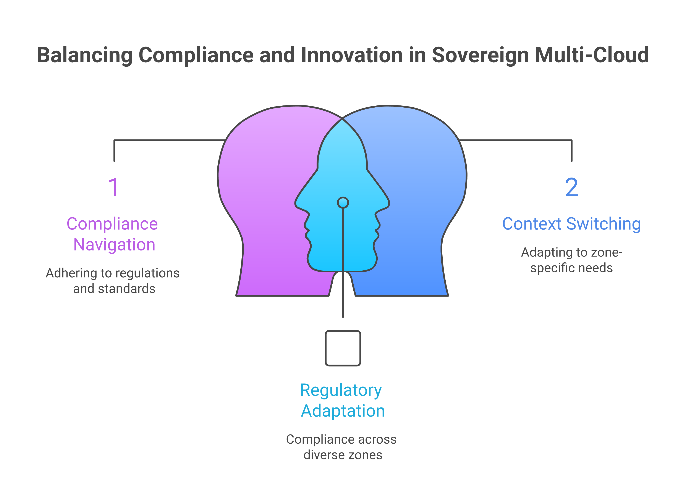
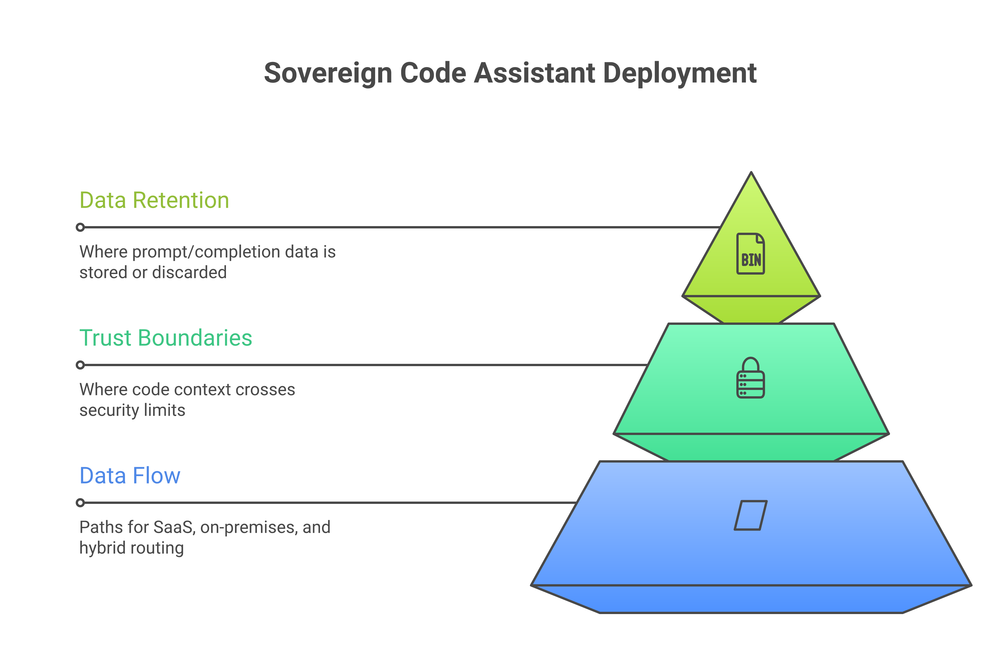
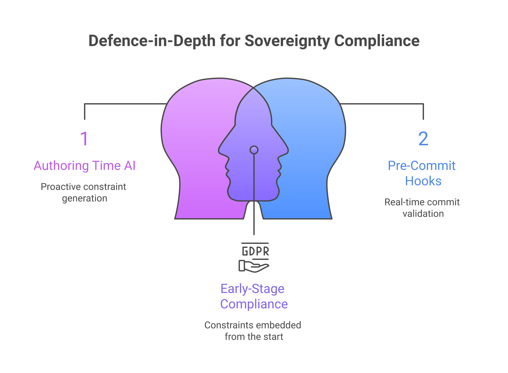
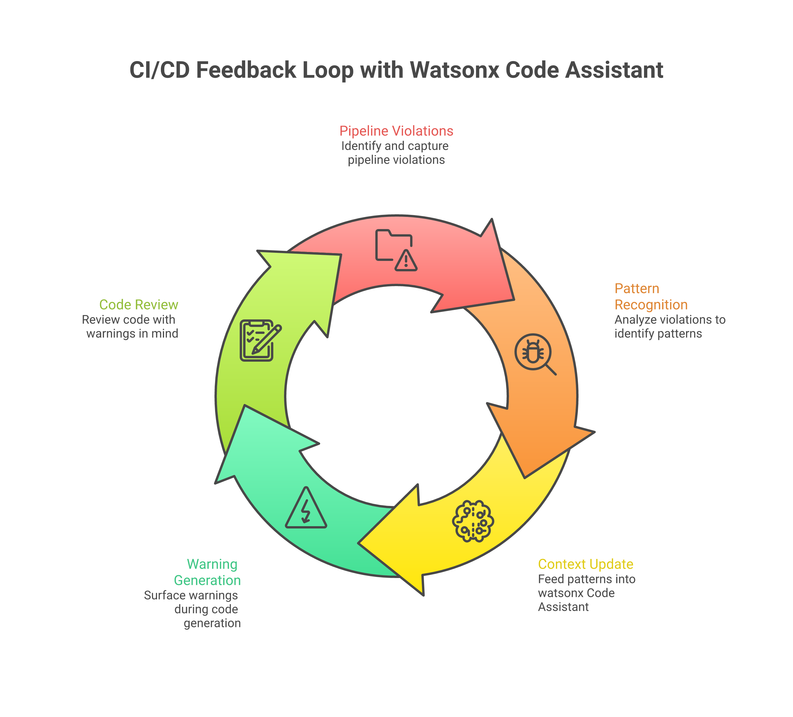
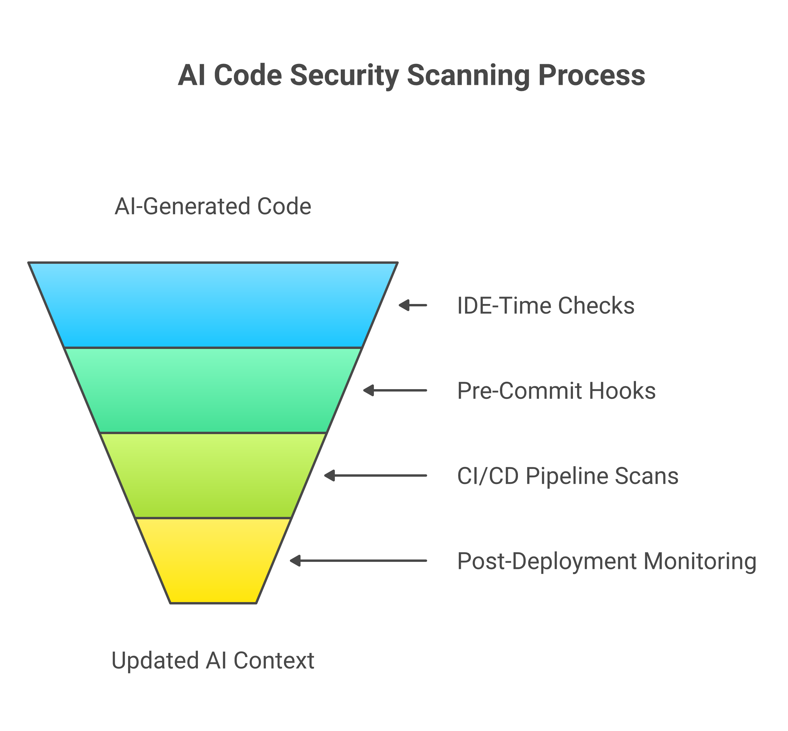
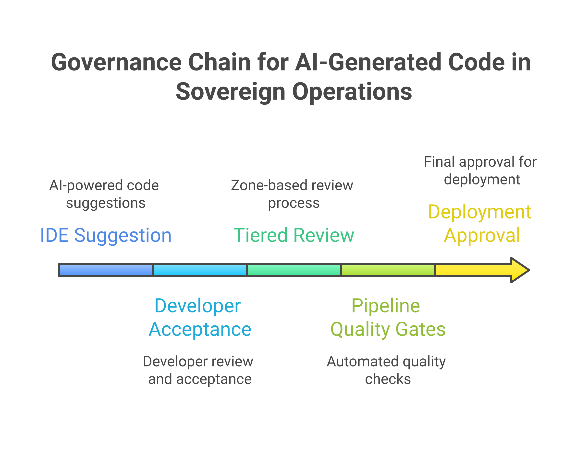

# Chapter 26 — AI-Assisted Development: watsonx Code Assistant as Engineering Partner

***

## Summary

This chapter provides architectural guidance for deploying AI code assistants in sovereign multi-cloud estates, using IBM watsonx Code Assistant and the Granite code models as the reference platform. It examines the deployment topology trade-offs — SaaS, on-premises, and hybrid — that determine where code context crosses trust boundaries and how prompt and completion data is handled under data residency constraints. The chapter establishes decision frameworks for selecting deployment topologies based on code classification, for choosing between retrieval-augmented generation and fine-tuning based on change velocity and pattern depth, and for defining zone-based AI code generation policies that calibrate governance rigour to classification level. Sovereignty-aware code generation for infrastructure as code and Ansible automation is presented as a defence-in-depth complement to pipeline quality gates. A substantial governance framework addresses intellectual property and licence compliance, three-level code provenance tracking, multi-layer security scanning of AI-generated code, tiered approval workflows, audit trail architecture, and the non-negotiable principle that human responsibility for code correctness is not diminished by AI assistance.

***

## 26.1 The case for AI-assisted development in sovereign operations

There is a particular kind of fatigue that accumulates in engineering teams responsible for sovereign, multi-cloud estates. It is not the fatigue of writing too many lines of code, though that is real enough. It is the fatigue of holding too many constraints in one's head simultaneously. When an engineer sits down to write a Terraform module for a new service deployment, they are not simply defining infrastructure; they are navigating a maze of jurisdictional requirements, encryption mandates, network segmentation rules, tagging conventions, identity trust boundaries, and organisational standards that vary by sovereign zone, by cloud provider, and sometimes by the regulatory mood of the quarter. The cognitive load is immense, and it grows with every new regulation, every new zone, and every new provider added to the estate.

The productivity data paints a sobering picture. Developer experience surveys consistently report that engineers in regulated industries spend between thirty and forty per cent of their working time on compliance-related tasks: reading policy documents, cross-referencing configuration against regulatory requirements, writing boilerplate that satisfies audit expectations, and reworking code that was correct by one standard but incorrect by another [1]. The 2024 Stack Overflow Developer Survey found that developers in enterprise environments rated "dealing with complexity and technical debt" as the single largest barrier to their productivity, ahead of meetings, unclear requirements, and tooling friction [2]. In sovereign operations, that complexity is not an accident or a sign of poor architecture; it is inherent in the problem. You cannot simplify away the fact that EU data must stay in EU regions, that DORA imposes specific ICT risk management obligations, or that each sovereign zone has its own key management hierarchy. The complexity is real, and it must be managed rather than wished away.

General-purpose coding assistants — the kind that suggest the next line of code based on patterns learned from public repositories — offer limited help in this context. They are remarkably good at completing syntactic patterns, generating boilerplate, and suggesting common library usage. What they are not good at is understanding the operational constraints that govern a particular organisation's sovereign estate. A general-purpose assistant trained predominantly on public GitHub repositories will happily suggest a Terraform configuration that places an S3 bucket in `us-east-1` when the sovereign zone requires `eu-central-1`. It will generate an IAM policy with `Action: "*"` because that pattern appears frequently in tutorials and examples, even though such a policy would fail every compliance gate in a regulated pipeline. It will suggest hardcoded credentials in configuration files because that pattern, regrettably, appears in thousands of public repositories. The assistant is not wrong in a syntactic sense; it is wrong in a contextual sense, and in sovereign operations, context is everything.

The case for AI-assisted development in sovereign environments is therefore not merely a productivity argument, though the productivity gains are real. It is a quality argument: an assistant that understands the constraints of the environment in which it operates can prevent entire categories of error that would otherwise propagate through the pipeline and be caught — if they are caught at all — only at the policy gate, the code review, or, worst of all, the audit finding. The shift-left principle, which [Chapter 25](25_chapter_ci_cd_quality_gates.html) examined in the context of CI/CD quality gates, applies equally to the developer's editor: the earlier a constraint violation is surfaced, the cheaper it is to fix and the less likely it is to reach production.

What sovereign operations teams need, then, is a code assistant architecture that satisfies three requirements simultaneously: deployment flexibility sufficient to keep code context within the sovereign boundary, customisation mechanisms that ground suggestions in organisational standards rather than public-internet patterns, and a governance framework that maintains human accountability for every line of generated code. IBM watsonx Code Assistant, built on the Granite code models, is one implementation of this architecture — and the one this chapter uses as its reference platform [3]. The remainder of this chapter examines the architectural decisions involved in deploying such an assistant, the sovereignty-specific capabilities it enables, and the governance framework required to use it responsibly.

***

## 26.2 Architecture of a sovereign code assistant

Deploying an AI code assistant in a sovereign estate is, at its core, an exercise in data-flow architecture. Every keystroke, every prompt, every completion travels a path from the developer's IDE to an inference endpoint and back. The architect's task is to ensure that every segment of that path satisfies the data residency, classification, and auditability requirements of the sovereign zone in which the code is being written. The choice of model, the placement of the inference endpoint, and the handling of prompt and completion telemetry are not product selection decisions — they are architectural decisions with regulatory consequences.

### 26.2.1 Model selection criteria for sovereign contexts

The foundation model that powers a code assistant determines the intellectual property posture of every line of generated code. When evaluating models for sovereign deployment, architects should assess four properties [4].

First, **training data provenance**. A model trained on permissively licensed code (Apache 2.0, MIT, BSD) presents a materially different IP risk profile from one trained on an undisclosed corpus that may include copyleft-licensed code. IBM's Granite code models publish a transparency report documenting training data composition and filtering criteria, which enables legal teams to assess licence exposure before deployment [4]. Regardless of the model chosen, the architect should require a provenance disclosure sufficient to satisfy the organisation's IP counsel that generated code does not carry undisclosed licence obligations.

Second, **model size and inference cost**. Code models range from compact variants (3–8 billion parameters) suitable for low-latency inline completion to larger variants (34 billion parameters and above) capable of more complex reasoning about code structure. The choice involves a direct trade-off: larger models produce higher-quality suggestions for complex tasks but require more GPU memory and incur higher inference latency. In an on-premises deployment where GPU capacity is constrained and shared across inference workloads, the architect may deploy a compact model for inline completion and route complex generation tasks to a larger model on a dedicated inference cluster — or accept the latency penalty of a single larger model. The decision should be informed by profiling actual developer interaction patterns: if ninety per cent of interactions are inline completions of fewer than ten lines, a compact model may deliver a better experience than a large model with higher latency.

Third, **on-premises deployability**. Not all code models can be deployed on customer infrastructure. Models available only through vendor-hosted APIs are architecturally incompatible with air-gapped zones. The Granite code models are distributed as container images deployable on OpenShift or equivalent Kubernetes platforms, which satisfies the requirement for on-premises deployment [3]. Any model the architect selects must be available in a form that can be deployed, updated, and retired entirely within the sovereign boundary.

Fourth, **customisability**. The ability to fine-tune the model on organisational code and to augment it with retrieval-augmented generation (RAG) determines how quickly the assistant can be grounded in enterprise-specific patterns. Section 26.6 examines the trade-offs between these two approaches in detail.

### 26.2.2 Deployment topology trade-offs

The placement of the inference endpoint is the single most consequential architectural decision in a code assistant deployment. Three topologies are available, and each carries a distinct set of trade-offs that the architect must evaluate against the organisation's sovereignty posture, operational maturity, and cost constraints [3].

**SaaS deployment** routes code context from the developer's IDE to a vendor-hosted inference endpoint — in the case of watsonx Code Assistant, hosted on IBM Cloud. The prompt payload includes the developer's current file, surrounding context, and the natural-language instruction; the response includes the generated code. The architect must evaluate several data-handling questions before approving this topology. What jurisdiction hosts the inference endpoint? Is the prompt payload encrypted in transit and at rest? Does the vendor retain prompt or completion data for model improvement, and can this retention be contractually prohibited? What classification levels of source code are permitted to traverse to the vendor's infrastructure under the organisation's data handling policy? For many organisations, SaaS deployment is appropriate for code classified as internal or public, but prohibited for code classified as confidential, restricted, or sovereignty-controlled. The operational advantage is significant: the vendor manages GPU infrastructure, model updates, scaling, and availability, removing these burdens from the platform team.

**On-premises deployment** places the inference endpoint entirely within the organisation's infrastructure — typically on a GPU-capable OpenShift cluster inside the sovereign zone. All code context remains within the network boundary. No prompt, completion, or telemetry data leaves the zone. This topology satisfies the most stringent data residency requirements, including air-gapped classified environments where no outbound connectivity is permitted. The cost is substantial: the organisation must provision and maintain GPU infrastructure (NVIDIA A100 or H100 accelerators are typical for production inference), manage model lifecycle through its own container registry and GitOps pipeline, monitor inference latency and throughput, and handle model updates without the benefit of vendor-managed rollouts. The architect should budget for a minimum of two GPU nodes for high availability, plus capacity planning that accounts for peak developer concurrency during working hours. For organisations with existing GPU infrastructure serving other AI workloads, the marginal cost of adding code assistant inference may be modest; for organisations deploying GPUs for the first time, the capital and operational expense is a significant consideration.

**Hybrid deployment** routes requests to different endpoints based on the classification of the code under development. The IDE plugin configuration maps workspace or project attributes — typically derived from the repository's metadata or the sovereign zone tag in the project's configuration — to an inference endpoint URL. An engineer working on regulated zone infrastructure code routes through the on-premises endpoint; the same engineer working on an internal tooling project routes through SaaS. This topology reflects the operational reality of most large enterprises, where development work spans multiple classification levels. The architect must design the routing logic carefully: misclassification of a workspace could route restricted code to a SaaS endpoint, creating a data residency violation. The routing configuration should be managed centrally through a policy distribution mechanism — not left to individual developer configuration — and audited periodically to verify that workspace-to-endpoint mappings remain correct as projects are created, reclassified, or decommissioned.

The following decision framework summarises the topology selection criteria. The architect should evaluate the organisation's position on each axis and select the topology — or combination of topologies — that satisfies all applicable constraints.

| Criterion | SaaS | On-premises | Hybrid |
|---|---|---|---|
| Code classification permitted | Internal, public | All, including restricted and classified | Mixed — per workspace |
| Data residency of code context | Vendor jurisdiction | Organisation jurisdiction | Split by classification |
| Prompt/completion data retention | Vendor-controlled (contractual) | Organisation-controlled | Split by endpoint |
| GPU infrastructure required | None | Organisation-provisioned | Partial |
| Model update lifecycle | Vendor-managed | Organisation-managed | Split |
| Air-gap compatible | No | Yes | Partial (on-prem path) |
| Operational overhead | Low | High | Medium |
| Latency profile | Network-dependent | LAN-local | Split |

### 26.2.3 Prompt and completion data handling

An often-overlooked aspect of code assistant architecture is the fate of prompt and completion data after inference. In a SaaS deployment, the architect must determine whether the vendor logs, retains, or uses prompt and completion data for model improvement. Many commercial code assistant providers retain this data by default and use it to improve their models — a practice that may be acceptable for general-purpose development but is incompatible with sovereignty requirements that prohibit the use of organisational code for third-party model training [11]. The contract and data processing agreement should explicitly address prompt data retention, completion data retention, telemetry collection, and the conditions under which data may be used for model improvement. IBM watsonx Code Assistant provides contractual commitments regarding data handling, but the architect should verify these commitments against the organisation's specific regulatory obligations rather than relying on general assurances [3].

In an on-premises deployment, prompt and completion data handling is entirely under organisational control — which means the organisation must decide its own retention and logging policy. Retaining inference logs supports audit, quality analysis, and governance investigations ("show me all AI-generated code suggestions accepted in the regulated zone last quarter"). Discarding inference logs reduces storage costs and limits the blast radius of a log data breach. The architect should design the inference logging architecture to satisfy audit requirements while applying the same data classification and retention policies to inference logs as to the source code they contain.

### 26.2.4 IDE integration and context boundaries

The IDE plugin that connects the developer's editor to the inference endpoint is a trust boundary component. It determines what code context is included in the prompt payload and how the response is presented to the developer. Plugins for Visual Studio Code and JetBrains IDEs typically assemble a context window comprising the current file, open files in the workspace, and — when configured — relevant files from the project repository [3]. This context window is what enables the assistant to generate suggestions consistent with existing naming conventions, provider aliases, and module structures.

For sovereign operations, the context window raises an architectural question: should the plugin be permitted to include files from outside the current workspace in the prompt payload? In a monorepo that spans multiple sovereign zones, including context from a different zone's directory could send zone-restricted code to an inference endpoint that is not approved for that zone's classification level. The architect should configure context boundaries that align with sovereign zone boundaries — ensuring that context assembly respects the same data classification rules that govern all other data movement in the estate. Where the IDE plugin does not natively support zone-aware context boundaries, the organisation should implement wrapper configuration or workspace isolation (separate workspaces per zone) to achieve the same effect.

***

## 26.3 Code generation with sovereignty awareness

The most immediate value of an AI coding assistant in a sovereign estate is not speed — though faster code generation is welcome — but correctness in context. An assistant that generates code quickly but incorrectly is worse than no assistant at all, because incorrect code that looks plausible is harder to catch in review than incorrect code that looks obviously wrong.

### 26.3.1 Infrastructure as code with zone constraints

When an engineer asks the assistant to generate a Terraform module for a new service deployment in a sovereign zone, the quality of the output depends on how much the assistant knows about the zone's constraints. A general-purpose assistant, knowing nothing of the zone, will generate syntactically valid Terraform that may violate every sovereignty requirement in the organisation's policy library. A context-grounded assistant — one operating with workspace context and, when enterprise customisation is configured, with access to the organisation's module registry and policy documentation — can generate Terraform that respects zone constraints by default [3].

Consider a concrete example. An engineer working in a European regulated zone requests a module to provision an encrypted storage bucket. The assistant, drawing on the workspace context that includes provider aliases tagged with `eu_regulated`, tagging conventions that include `jurisdiction=EU` and `data-classification=restricted`, and encryption patterns that reference a zone-specific KMS key, generates a module that:

- Uses the `aws.eu_regulated` provider alias, ensuring the bucket is created in the correct account and region.
- Applies the standard sovereign zone tags, including jurisdiction, data classification, and owning team.
- Configures server-side encryption with a reference to the zone's KMS key ARN, drawn from the remote state output of the key management module.
- Enables versioning and access logging to a zone-local logging bucket.
- Includes a `precondition` block that validates the region against the approved list for the zone classification.

None of these elements is individually complex. An experienced engineer would include all of them. But the cognitive load of remembering all of them — every time, without exception, across dozens of modules and hundreds of resources — is precisely the kind of load that produces errors under pressure. The assistant does not forget the tagging convention on the third module of the day. It does not accidentally use the wrong provider alias because it was copied from a different workspace. It generates the complete, compliant pattern every time, and the engineer's task shifts from remembering constraints to reviewing and validating the output [5].

### 26.3.2 Encoding regulatory requirements into generated code

Beyond individual resource configurations, the assistant can encode broader regulatory patterns into the code it generates. When an organisation's policy library specifies that all databases in a particular zone must have automated backups with a minimum retention period, that TLS must be version 1.2 or later for all endpoints, and that access logging must be enabled for all storage resources, these requirements can be embedded in the assistant's context through retrieval-augmented generation (discussed in section 26.6). The assistant then includes these requirements in every relevant suggestion, not because it has been explicitly asked to include them for each resource, but because they are part of the context that shapes its generation.

This approach is complementary to, not a replacement for, the policy-as-code gates described in [Chapter 25](25_chapter_ci_cd_quality_gates.html). The assistant applies constraints at generation time; the pipeline gates enforce them at deployment time. The two mechanisms operate at different points in the development lifecycle and serve different purposes. The assistant reduces the frequency of constraint violations that reach the pipeline; the pipeline gates ensure that any violations that do reach them are caught before deployment. Together, they implement a defence-in-depth model for sovereignty compliance that is stronger than either mechanism alone.

### 26.3.3 Multi-cloud awareness

Sovereign estates are almost invariably multi-cloud, and the code generation challenge in a multi-cloud environment is that the same logical intent — "create an encrypted storage bucket" — translates into different provider-specific configurations for AWS, Azure, GCP, and IBM Cloud. A developer fluent in AWS Terraform may be less fluent in Azure ARM templates or GCP provider resources. The assistant bridges this gap by translating intent into provider-specific code, drawing on its training across multiple cloud provider ecosystems and on the workspace context that indicates which provider is in use for the current module [3].

This capability is particularly valuable for platform engineering teams responsible for maintaining sovereign zone modules across multiple cloud providers. When a new sovereignty requirement is introduced — for example, a mandate to enable object lock on all storage buckets — the assistant can generate the implementation for each cloud provider's specific API and resource schema, reducing the time required to propagate the requirement across the estate and reducing the risk that the implementation is correct for AWS but subtly wrong for Azure because the engineer is less familiar with the Azure provider's resource model.

***

## 26.4 Ansible content generation and modernisation

Infrastructure-as-code generation addresses the provisioning layer, but sovereign operations extends far beyond provisioning. The configuration management layer — operating system hardening, security baseline enforcement, certificate management, compliance scanning — is equally sovereignty-critical, and in many estates it is implemented through Ansible. The architectural challenge in this domain is not merely generating syntactically correct playbooks but ensuring that generated automation is idempotent, auditable, and compatible with the policy-gated pipeline model that sovereign operations demands. The Ansible Lightspeed integration with watsonx Code Assistant provides one implementation of AI-assisted Ansible content generation [6], and the architectural patterns it embodies apply broadly to any AI-assisted configuration management workflow.

### 26.4.1 Generating playbooks from natural language

The generation of Ansible playbooks from natural-language descriptions follows the same context-grounding principles as infrastructure-as-code generation. An engineer describes the desired outcome — "harden an RHEL 9 server according to CIS Level 2 benchmarks, ensuring that all audit logging is directed to the zone's central syslog server" — and the assistant generates a playbook that implements the described intent using appropriate Ansible modules, roles, and variables [6].

The quality of the generated playbook depends on the specificity of the description and the context available to the assistant. A vague request ("set up a server") produces a generic result that will require substantial editing. A specific request that includes the target operating system, the compliance framework, the organisational naming conventions, and the zone-specific parameters produces a result closer to production-ready. The architect should recognise this as a design implication for the RAG knowledge base (section 26.6): the more comprehensive the Ansible-specific content in the knowledge base — role conventions, variable naming standards, collection preferences, zone-specific endpoint addresses — the higher the quality of generated playbooks.

For sovereign operations, the playbooks that configure operating systems, harden security baselines, manage certificates, and enforce compliance standards are as sovereignty-critical as the Terraform modules that provision the infrastructure underneath them. A playbook that configures syslog forwarding to an endpoint outside the sovereign zone is as much a sovereignty violation as a Terraform module that creates a resource in the wrong region. The same context-grounding mechanisms that prevent infrastructure-as-code zone violations — workspace context, RAG knowledge base, zone-aware generation policies — must be applied to Ansible content generation.

### 26.4.2 Modernising legacy automation

Many organisations carry a substantial body of legacy automation: shell scripts written over years of operational necessity, Perl or Python scripts that configure systems in procedural fashion, and early-generation Ansible playbooks that use deprecated modules, raw command execution, or non-idempotent patterns. This legacy automation works — in the sense that it produces the desired outcome when executed — but it is fragile, difficult to audit, and often incompatible with the declarative, idempotent, policy-gated pipeline model that sovereign operations requires.

AI-assisted code transformation addresses this challenge by translating procedural automation into declarative Ansible playbooks. An engineer presents a legacy shell script and the assistant analyses its logic, identifies the corresponding Ansible modules for each operation (replacing `useradd` commands with `ansible.builtin.user`, `iptables` commands with `ansible.posix.firewalld`, and so on), and generates a playbook that is idempotent, declarative, and compatible with the organisation's linting and testing standards [6].

The architectural significance of this transformation extends beyond syntax. A shell script that configures a system through a sequence of commands has an implicit order dependency: step three assumes that steps one and two have already been executed. An Ansible playbook that achieves the same outcome through declarative module invocations has an explicit dependency structure, and each task can be individually tested and validated. The modernised automation is more auditable — each task states its intent in a human-readable `name` field — and more compatible with the policy-as-code framework, because `ansible-lint` can validate the playbook against organisational rules before execution. For sovereign estates carrying years of legacy automation technical debt, this transformation capability is a practical path from ad-hoc scripting to governed, auditable configuration management.

### 26.4.3 Quality and security of generated automation

Generated Ansible content must be held to the same quality and security standards as handwritten content. The assistant's output is a starting point, not a finished product. Every generated playbook should pass through `ansible-lint` with the organisation's custom rule set, through `yamllint` for structural correctness, and through the CI/CD quality gates described in [Chapter 25](25_chapter_ci_cd_quality_gates.html) before being merged or executed [6].

Particular attention must be paid to secrets handling in generated playbooks. The assistant should generate playbooks that reference secrets through Ansible Vault, HashiCorp Vault lookups, or the organisation's designated secrets management mechanism — never as plaintext values embedded in the playbook. If the assistant's training data or context includes patterns where secrets appear in plaintext (as they regrettably do in many public examples), the organisation's customisation layer and linting rules must catch and correct these patterns before they reach production.

***

## 26.5 Code review and security analysis

The value of an AI assistant does not end when code is generated. It extends into the review process, where the assistant can identify patterns that human reviewers might miss — not because the reviewers are careless, but because the volume and complexity of changes in a sovereign estate exceed what any human can reliably inspect under time pressure.

### 26.5.1 AI-assisted code review

An AI code assistant integrated into the code review workflow provides automated analysis of pull requests before human reviewers examine them. The assistant examines proposed changes against project context and flags potential issues: inconsistent naming conventions, missing required tags, deviation from established patterns in the codebase, use of deprecated APIs or modules, and structural problems that may cause downstream issues. watsonx Code Assistant and comparable tools support this integration through IDE plugins and CI/CD webhook integrations [3].

In sovereign operations, the review focus extends beyond general code quality to sovereignty-specific concerns. The assistant can identify:

- **Cross-zone references** — code that references resources, endpoints, or secrets in a different sovereign zone without the explicit cross-zone authorisation that the organisation's policy requires.
- **Encryption gaps** — resources created without encryption configuration, or with encryption referencing a key outside the zone's key hierarchy.
- **Region violations** — resources provisioned in regions not approved for the zone's classification, which may be syntactically valid but jurisdictionally incorrect.
- **Privilege escalation patterns** — IAM policies or role bindings that grant broader permissions than the principle of least privilege would allow, particularly trust relationships that span zone boundaries.
- **Logging and audit gaps** — resources that do not configure the access logging or audit trails required by the zone's compliance framework.

These are not static analysis rules in the traditional sense — tools like OPA and Checkov handle that role in the pipeline. The assistant's contribution is in identifying patterns that are contextually inappropriate even when they are syntactically valid and may pass static analysis rules. A security group rule that allows inbound traffic on port 8080 is not inherently wrong; it is wrong if the service in question should only be accessible through the zone's ingress controller, a contextual determination that requires understanding the surrounding architecture.

### 26.5.2 Integration with pipeline quality gates

The assistant's review capabilities complement, rather than replace, the pipeline quality gates from [Chapter 25](25_chapter_ci_cd_quality_gates.html). The relationship is sequential: the assistant provides early feedback during authoring and review, catching issues before they enter the pipeline, while the quality gates provide definitive enforcement, catching anything the assistant missed. The assistant is advisory; the gates are authoritative.

The integration between the two is bidirectional. When a pipeline gate rejects a change for a policy violation, the rejection reason can be fed back to the assistant as context, improving the accuracy of its future suggestions and reviews. If the OPA gate consistently rejects configurations that reference a particular deprecated encryption algorithm, the assistant should learn — through its context or through enterprise customisation — to stop suggesting that algorithm. This feedback loop between pipeline enforcement and AI-assisted generation creates a self-improving system where the most common violations are progressively eliminated at the point of authoring rather than at the point of deployment [5].

### 26.5.3 Security vulnerability detection

Beyond policy compliance, the assistant contributes to security analysis by identifying vulnerability patterns in generated and handwritten code. Common patterns in sovereign operations codebases — overly permissive network rules, unencrypted data paths, hardcoded credentials, missing input validation in API definitions — can be flagged during both generation and review. The assistant's training on secure coding patterns, augmented by the organisation's security standards through RAG, allows it to surface security concerns that may not be caught by static analysis tools focused on specific vulnerability signatures [7].

The assistant is not a replacement for dedicated security scanning tools (SAST, DAST, SCA), which perform deep analysis against known vulnerability databases. It is an additional layer that operates earlier in the development cycle and applies a broader, more contextual analysis than rule-based scanners. The two approaches are complementary: the assistant catches design-level security concerns during authoring; the dedicated scanners catch implementation-level vulnerabilities during pipeline execution.

***

## 26.6 Enterprise customisation and knowledge grounding

The difference between a generic AI coding assistant and an effective engineering partner in a sovereign estate lies in customisation: the ability to ground the assistant's suggestions in the specific patterns, standards, and constraints of the organisation. Two complementary mechanisms are available — retrieval-augmented generation and fine-tuning — and the architect must understand the trade-offs between them to design a customisation strategy that matches the organisation's operational maturity, change velocity, and sovereignty requirements.

### 26.6.1 Retrieval-augmented generation

Retrieval-augmented generation (RAG) augments the model's inference request with content retrieved from an enterprise knowledge base at query time. The retrieved content — internal API documentation, sovereign zone policy documents, approved module registries, coding standards, architectural decision records — is included in the model's context window alongside the developer's prompt and local code context, allowing the model to generate suggestions that reflect organisational standards without any modification to its weights [8].

For sovereign operations, the RAG knowledge base should include sovereign zone definitions (zones, classifications, approved regions, constraints), module registry documentation (interfaces, required variables, correct usage examples), policy documentation (OPA, Kyverno, or Sentinel policies in a form the model can reference), architectural decision records (reasoning behind specific patterns), and incident post-mortems (historical configuration errors to avoid). The breadth of this content is what transforms the assistant from a generic code completer into a context-aware partner.

The RAG knowledge base is itself a sovereign data asset that must be treated with the same classification and residency discipline as the code it informs. If the knowledge base contains zone-restricted policy documents, it must be hosted within the zone boundary and accessed only by inference endpoints authorised for that zone's classification level. In a hybrid deployment, the on-premises inference endpoint accesses a zone-local knowledge base; the SaaS endpoint accesses a separate knowledge base containing only non-restricted content. The architect must ensure that the RAG indexing pipeline respects data classification boundaries — a failure to do so could result in restricted content being included in prompts routed to a SaaS inference endpoint.

The knowledge base must be kept current. Stale documentation produces confidently incorrect suggestions — a particularly dangerous failure mode because the suggestion looks authoritative even when it references a deprecated policy or a decommissioned module version. A pipeline that automatically indexes updated policy documents, module release notes, and zone definitions into the RAG knowledge base ensures that the assistant's grounding reflects current organisational state. The indexing pipeline should be triggered by the same events that update the policy library: policy merges, module releases, zone configuration changes.

### 26.6.2 Fine-tuning for enterprise patterns

Where RAG augments context at inference time, fine-tuning modifies the model's weights to encode enterprise-specific patterns more deeply. The Granite code models support fine-tuning on an organisation's own codebase, producing a model variant that has internalised the organisation's naming conventions, module structures, and coding idioms [3].

Fine-tuning is a substantially heavier operation than RAG. It requires curating a training dataset from the organisation's code repositories (with appropriate filtering to exclude deprecated, non-compliant, or low-quality code), running a training pipeline on GPU infrastructure, evaluating the resulting model against a held-out test set, and managing the lifecycle of fine-tuned model versions — including rollback if a new version degrades suggestion quality. In a sovereign deployment, the training pipeline itself must execute within the zone boundary if the training data includes zone-restricted code, which means the organisation must have GPU infrastructure sufficient not only for inference but also for periodic training runs.

The payoff is that fine-tuned models produce suggestions requiring less post-generation editing. The model's statistical priors shift towards organisational patterns: it defaults to the organisation's variable naming convention rather than the convention most common in its public training data, it structures modules according to the organisation's standard layout rather than a generic layout, and it applies error handling patterns consistent with the codebase it was fine-tuned on.

### 26.6.3 Deciding between RAG and fine-tuning

The choice between RAG and fine-tuning is not binary — most mature deployments use both — but the architect must understand where each mechanism is strongest and allocate investment accordingly. The following decision criteria should guide the customisation strategy.

**Change velocity.** RAG excels at incorporating frequently changing information because the knowledge base can be updated without retraining the model. When sovereign zone definitions change quarterly, when the policy library is updated monthly, or when module versions are released weekly, RAG propagates these changes to the assistant within hours of the knowledge base being re-indexed. Fine-tuning, by contrast, encodes patterns at training time; a change to the knowledge base has no effect on the fine-tuned model until the next training cycle. For dynamic context, RAG is the appropriate mechanism.

**Pattern depth.** Fine-tuning excels at encoding stable, structural patterns that change infrequently but should be deeply embedded in the model's generation behaviour. Naming conventions, module layout structures, error handling idioms, and testing patterns are poor candidates for RAG because they are too numerous and too granular to be reliably retrieved for every prompt. Fine-tuning encodes these patterns in the model's weights, where they influence every suggestion without requiring explicit retrieval. For structural conventions, fine-tuning is the appropriate mechanism.

**Operational cost.** RAG requires a knowledge base infrastructure (vector store, indexing pipeline, retrieval service) that must be operated and maintained. Fine-tuning requires GPU infrastructure, training pipelines, model evaluation, and version management. For organisations with limited platform engineering capacity, starting with RAG and deferring fine-tuning until the assistant is in steady-state use is a pragmatic approach that delivers the majority of the customisation benefit at a fraction of the operational cost.

**Sovereign data handling.** Both mechanisms involve sovereign data — the RAG knowledge base contains policy documents and code examples; the fine-tuning dataset contains organisational code. In both cases, the data must be handled according to the organisation's classification policies. However, fine-tuning embeds information in model weights, which creates a data retention challenge: once the model has been trained on sovereign data, that data cannot be selectively removed from the weights. If the organisation decommissions a sovereign zone and wishes to purge all associated data, the fine-tuned model must be retrained from scratch on a dataset that excludes the decommissioned zone's code. RAG, by contrast, allows selective deletion from the knowledge base without affecting the model. This distinction matters for organisations subject to data lifecycle requirements that mandate purging of decommissioned zone data.

A well-configured sovereign deployment typically begins with RAG for rapid grounding, adds fine-tuning after six to twelve months of usage data has been collected (providing a curated training dataset), and operates both mechanisms in parallel thereafter — RAG for dynamic policy context, fine-tuning for stable structural patterns.

### 26.6.4 Keeping the assistant current

Sovereign requirements are not static. New regulations are enacted. Existing regulations are reinterpreted. Zones are created, modified, or decommissioned. Cloud providers introduce new services and deprecate old ones. The assistant must evolve with these changes, or it will drift from helpfulness into harm.

The mechanisms for keeping the assistant current mirror the mechanisms for keeping any software component current: versioned releases of the RAG knowledge base, scheduled fine-tuning refreshes against the latest codebase, and monitoring of the assistant's suggestion quality through acceptance rate metrics and review feedback. If the acceptance rate of the assistant's suggestions drops — indicating that developers are rejecting more suggestions than they accept — the decline is a signal that the assistant's context has drifted from the organisation's current standards and that a knowledge base update or fine-tuning refresh is warranted.

The feedback loop between pipeline enforcement and assistant context, described in section 26.5.2, provides an automated mechanism for identifying specific areas where the assistant's suggestions have diverged from current policy. When the pipeline rejects a pattern that the assistant frequently suggests, the pattern should be flagged for inclusion in the RAG knowledge base as a negative example ("do not generate this pattern; use this alternative instead") and, if the pattern is structural rather than contextual, for inclusion in the next fine-tuning dataset with corrected examples.

***

## 26.7 Governance of AI-generated code

The introduction of AI-generated code into a sovereign estate raises governance questions that are more consequential than those posed by any previous development tooling change. When a developer adopts a new IDE or switches from one linting tool to another, the governance impact is minimal — the code they produce is still entirely their own. When a developer begins accepting code suggestions from a foundation model trained on billions of lines of external code, the organisation acquires obligations around intellectual property, provenance, security validation, and accountability that must be addressed architecturally rather than through informal guidance. These questions must be answered before the assistant is deployed, not after.

### 26.7.1 Intellectual property and licence compliance

Code generated by an AI model is derived, in a statistical sense, from the model's training data. The intellectual property status of that generated code depends on the provenance discipline applied during model training. Models trained on datasets that include copyleft-licensed code (GPL, AGPL) may generate suggestions that reproduce patterns, function signatures, or even verbatim fragments from that code, creating potential licence compliance issues for organisations that cannot accept copyleft obligations in their codebases [9].

The architect's first line of defence is model selection. Models trained exclusively on permissively licensed code — as the Granite code models are, with a published transparency report documenting training data composition and filtering criteria [4] — present a materially lower IP risk than models trained on undisclosed corpora. However, training data provenance alone does not eliminate licence risk. Even a model trained on permissively licensed code can generate output that coincidentally resembles copyleft-licensed code in public repositories, and the legal status of such coincidental similarity remains unsettled in most jurisdictions. Vendor IP indemnification provisions — where the vendor assumes liability for IP claims arising from model output — provide a second line of defence, but their scope varies by contract and jurisdiction and should be reviewed by the organisation's legal counsel rather than accepted at face value.

The architect's second line of defence is automated licence scanning integrated into the CI/CD pipeline. The software composition analysis (SCA) step described in [Chapter 25](25_chapter_ci_cd_quality_gates.html) should be configured to flag generated code that matches known copyleft-licensed patterns. This is not a theoretical concern: studies have documented that large language models can, in certain conditions, reproduce near-verbatim fragments from their training data, particularly for highly distinctive code patterns such as licence headers, algorithm implementations, and API client boilerplate [9]. The SCA scan provides a safety net that catches such reproductions before they enter the codebase.

Organisations that augment the code assistant through RAG with content from internal repositories must also assess the licence terms of that internal content. If the RAG knowledge base includes code snippets from acquired companies, open-source forks, or vendor-provided sample code, the licence terms of those snippets propagate into the assistant's suggestions. The RAG content curation process should include licence review as a mandatory step.

### 26.7.2 Code provenance tracking and attribution

In a regulated sovereign environment, the ability to determine the origin of any line of code — who wrote it, when, under what circumstances, and with what tooling assistance — is not a convenience but a compliance obligation. AI-assisted development introduces a new category of code origin that must be tracked with the same rigour as human-authored code.

A well-designed provenance architecture captures AI involvement at three levels. At the **suggestion level**, the IDE plugin logs each suggestion presented to the developer, including the prompt context, the model version, the timestamp, and whether the developer accepted, modified, or rejected the suggestion [3]. At the **commit level**, the version control system records AI involvement through structured metadata — a Git trailer such as `AI-Assisted-By: watsonx-code-assistant/granite-34b-v2.1` or a commit message convention that the organisation defines and enforces through pre-commit hooks. At the **deployment level**, the CI/CD pipeline carries the AI provenance metadata forward through the attestation chain described in [Chapter 25](25_chapter_ci_cd_quality_gates.html), so that a deployed artefact can be traced back through the pipeline to the commits that comprise it, and from those commits to the AI suggestions that contributed to them.

This three-level provenance chain enables audit queries that would otherwise be impossible: "list all AI-assisted changes deployed to the EU regulated zone in Q3," "compare the defect rate of AI-generated Terraform with human-authored Terraform over the past six months," or "identify all deployments that include code generated by model version X, which has been superseded." These queries are essential for governance reporting, for quality improvement, and for regulatory response — particularly under the EU AI Act, which imposes transparency obligations on organisations deploying AI systems in certain risk categories [10].

### 26.7.3 Security scanning of AI-generated code

AI-generated code must be subjected to security scrutiny that is at least as rigorous as — and arguably more rigorous than — the scrutiny applied to human-authored code. The rationale is straightforward: a human developer who has worked in a sovereign estate for years has internalised many of the security patterns specific to the environment. A foundation model, even one fine-tuned on organisational code, generates from statistical patterns that may include insecure idioms prevalent in public training data.

The security scanning architecture for AI-generated code should include the following layers, applied in sequence from the point of generation to the point of deployment.

**IDE-time scanning.** The IDE plugin or a companion extension runs lightweight security checks on each accepted suggestion before it is saved to the file. These checks target the most common and most dangerous patterns: hardcoded credentials, overly permissive IAM policies, unencrypted resource configurations, and cross-zone references. The checks operate on the suggestion in isolation and on the suggestion in the context of the surrounding code. A suggestion that assigns `Action: "*"` to an IAM policy statement should be flagged immediately, not left for the pipeline to catch minutes or hours later.

**Pre-commit scanning.** The pre-commit hook framework described in [Chapter 25](25_chapter_ci_cd_quality_gates.html) applies a second layer of scanning before the code enters the repository. Pre-commit hooks can run `tfsec`, `checkov`, or equivalent tools against the staged changes, catching infrastructure-as-code security issues that the IDE-time scan may not have covered. For Ansible content, `ansible-lint` with a security-focused rule set serves the same purpose.

**Pipeline scanning.** The CI/CD pipeline's SAST, DAST, SCA, and container scanning stages provide the authoritative security assessment. These scans operate on the complete codebase and on the built artefacts, applying vulnerability databases, licence compliance checks, and organisational policy rules. The pipeline scan is the last automated gate before deployment and must be treated as authoritative regardless of whether earlier scans passed.

**Post-deployment monitoring.** For infrastructure-as-code that has been deployed, runtime security monitoring — cloud security posture management (CSPM) tools, Kubernetes admission controllers, and the continuous compliance mechanisms described in [Chapter 10](10_chapter_continuous_compliance.html) — provides ongoing validation that the deployed configuration matches the security intent. This layer catches configuration drift that may result from AI-generated code that was correct at generation time but has been rendered non-compliant by subsequent policy changes.

### 26.7.4 Approval workflows and zone-based generation policies

Not all code in a sovereign estate should be subject to the same AI generation policy. The architect should define a tiered approval framework that maps AI code generation permissions to the classification level of the code being written and the sovereign zone in which it will be deployed.

At the most permissive tier — applicable to internal tooling, development utilities, and code in non-regulated zones — AI code generation is permitted with standard code review. The developer accepts or modifies suggestions, commits the code with provenance metadata, and the change proceeds through the normal review and pipeline process.

At an intermediate tier — applicable to production infrastructure code in regulated but non-classified zones — AI code generation is permitted but subject to enhanced review. The enhanced review may require that AI-generated changes are reviewed by a second reviewer in addition to the standard reviewer, that the reviewer is explicitly notified of AI involvement (through the provenance metadata in the pull request), and that the reviewer attests to having validated the AI-generated portions against the zone's policy requirements. This tiered approach adds review overhead proportional to risk without prohibiting AI assistance entirely.

At the most restrictive tier — applicable to classified zones, cryptographic infrastructure, identity trust boundaries, and code that directly implements regulatory controls — the organisation may choose to prohibit AI code generation entirely, or to permit it only in a "suggest and discard" mode where the assistant's output is used as a reference but is not directly accepted into the codebase. The rationale is not that the assistant cannot generate correct code for these contexts, but that the governance burden of validating AI-generated code in the highest-risk areas may exceed the productivity benefit.

The zone-based generation policy should be enforced technically, not merely through guidance documents that developers may overlook. The IDE plugin configuration, managed centrally through the same policy distribution mechanism that governs workspace-to-endpoint routing (section 26.2.2), should disable or restrict AI code generation features for workspaces associated with restricted zones. The pipeline should validate that commits to restricted-zone repositories do not include AI provenance metadata unless the enhanced review process has been completed and attested.

### 26.7.5 Audit trail architecture

The audit trail for AI-assisted code must satisfy the same requirements as the audit trail for any other change in a sovereign estate: it must be complete, it must be tamper-evident, and it must be queryable. Every AI-assisted change should be traceable from the suggestion in the IDE, through the commit in version control, through the pipeline execution that validated and deployed it, to the running configuration in the sovereign zone.

The existing audit mechanisms — Git history, pipeline logs, deployment records, and the Concert entity model described in [Chapter 14](14_chapter_concert_architecture.html) — provide the infrastructure for this trail. The additional requirement is that the AI provenance metadata is carried through the entire chain, so that an auditor can determine not only what changed and who approved it, but whether the change originated from an AI suggestion and, if so, what model version and context produced that suggestion. The provenance metadata schema should be standardised across the organisation: a consistent set of fields (model identifier, model version, prompt hash, suggestion timestamp, accepting developer) recorded in a consistent format (structured Git trailers, pipeline attestation fields, and Concert entity attributes) ensures that audit queries produce reliable results regardless of which team or zone generated the code.

### 26.7.6 Human responsibility and the approval boundary

A principle that must be stated directly, because the temptation to erode it is strong: AI-generated code does not reduce human responsibility for the code's correctness, security, or compliance. The assistant generates suggestions; the developer accepts, modifies, or rejects them; the reviewer approves or blocks them; the pipeline enforces policy gates. At no point in this chain does the AI bear responsibility. The developer who accepts a suggestion is as responsible for its content as if they had typed every character themselves [10].

This principle has practical implications for how AI-assisted development is integrated into the sovereign operations workflow. Code review must remain mandatory for AI-generated code — and during the adoption phase, the organisation may reasonably require that AI-generated changes receive more scrutiny than handwritten changes, not less. Pipeline quality gates must remain authoritative regardless of the code's origin. And the organisation's approval hierarchy — the chain of human decisions that authorises a change to reach production — must not be shortened or bypassed because the code was generated by a trusted model. The assistant accelerates development; it does not automate approval.

The EU AI Act reinforces this principle by establishing that organisations deploying AI systems remain responsible for the outputs of those systems, regardless of the degree of automation involved [10]. In practice, this means that an organisation cannot defend a compliance failure by arguing that the AI generated incorrect code. The approval boundary — the point at which a human reviewer accepts responsibility for a change — must be clearly defined, consistently enforced, and auditably recorded.

***

## Key Takeaways

- **Cognitive load, not coding speed, is the primary bottleneck** in sovereign multi-cloud development. AI assistants deliver value by reducing the burden of holding jurisdictional, regulatory, and organisational constraints simultaneously in mind.

- **Deployment topology is a data-flow architecture decision.** The choice between SaaS, on-premises, and hybrid determines where code context crosses trust boundaries. The architect must evaluate code classification, data residency obligations, GPU infrastructure costs, and prompt/completion data retention before selecting a topology.

- **Model selection requires provenance assessment.** Training data provenance, on-premises deployability, model size trade-offs, and customisability are the four evaluation axes. Documented provenance enables IP risk assessment; on-premises deployability is mandatory for air-gapped and classified zones.

- **Sovereignty-aware code generation** applies zone constraints, encryption mandates, tagging conventions, and regulatory requirements at authoring time — complementing, not replacing, the pipeline quality gates that enforce them at deployment time.

- **RAG and fine-tuning serve complementary purposes.** RAG excels at dynamic context (policy updates, zone changes); fine-tuning encodes stable structural patterns (naming conventions, module layouts). Most mature deployments use both, starting with RAG and adding fine-tuning after sufficient usage data is collected.

- **Zone-based generation policies** should calibrate AI code generation permissions to classification level — permissive for internal tooling, enhanced review for regulated zones, restricted or prohibited for classified infrastructure — and enforce these policies technically through IDE configuration and pipeline validation.

- **AI-generated code requires multi-layer security scanning** — IDE-time checks, pre-commit hooks, pipeline SAST/SCA, and post-deployment CSPM — because foundation models may reproduce insecure idioms from training data.

- **Three-level provenance tracking** (suggestion, commit, deployment) enables audit queries across the full lifecycle of AI-assisted changes and supports quality analysis of AI-generated versus human-authored code.

- **Human responsibility is not diminished** by AI assistance. The EU AI Act reinforces that organisations remain accountable for AI system outputs. The approval boundary must be clearly defined, consistently enforced, and auditably recorded.

***

## Bridge to Chapter 27 — Chat-First Operational UX

With AI-assisted development established as an engineering partner that operates within sovereign constraints — subject to deployment topology decisions, zone-based generation policies, and a governance framework that preserves human accountability — the question shifts from how engineers write code to how operators interact with the running estate. [Chapter 27](27_chapter_chat_first_ux.html) examines the chat-first operations paradigm: the conversational interface through which operators query, investigate, and act on their sovereign estate through natural-language dialogue rather than through disparate dashboards and command lines. Where this chapter addressed AI partnership in the development lifecycle, the next addresses AI partnership in the operational lifecycle — and the sovereignty-aware boundaries that govern what a conversational agent may see, suggest, and execute within each zone.

***

## References

[1] S. Endres, S. Weber, and H. Helm, "Developer productivity in regulated environments: a survey of compliance overhead in financial services software engineering," *IEEE Software*, vol. 41, no. 3, pp. 56–64, May/Jun. 2024. [Online]. Available: https://doi.org/10.1109/MS.2024.3370567

[2] Stack Overflow, "2024 Developer Survey Results," Stack Overflow, 2024. [Online]. Available: https://survey.stackoverflow.co/2024/

[3] IBM, "IBM watsonx Code Assistant," IBM Documentation, 2025. [Online]. Available: https://www.ibm.com/products/watsonx-code-assistant

[4] IBM Research, "Granite Code Models: a family of open foundation models for code intelligence," IBM Research Technical Report, 2024. [Online]. Available: https://research.ibm.com/publications/granite-code-models

[5] T. Zimmermann, "AI-assisted software engineering: integrating code generation into enterprise development workflows," in *Proc. IEEE/ACM Int. Conf. Automated Software Engineering (ASE)*, 2024, pp. 312–321.

[6] Red Hat, "Red Hat Ansible Lightspeed with IBM watsonx Code Assistant," Red Hat Documentation, 2025. [Online]. Available: https://www.redhat.com/en/technologies/management/ansible/ansible-lightspeed

[7] OWASP Foundation, "OWASP Top Ten 2021," OWASP, 2021. [Online]. Available: https://owasp.org/Top10/

[8] P. Lewis et al., "Retrieval-augmented generation for knowledge-intensive NLP tasks," in *Advances in Neural Information Processing Systems (NeurIPS)*, vol. 33, 2020, pp. 9459–9474. [Online]. Available: https://proceedings.neurips.cc/paper/2020/hash/6b493230205f780e1bc26945df7f3d0b-Abstract.html

[9] A. Kang, S. McIlroy, and A. E. Hassan, "License compliance in AI-generated code: risks and mitigations for enterprise adoption," *ACM Computing Surveys*, vol. 56, no. 8, pp. 1–35, Aug. 2024.

[10] European Commission, "Artificial Intelligence Act," Regulation (EU) 2024/1689, Official Journal of the European Union, Jul. 2024. [Online]. Available: https://eur-lex.europa.eu/eli/reg/2024/1689

[11] N. Carlini et al., "Extracting training data from large language models," in *Proc. 30th USENIX Security Symposium*, 2021, pp. 2633–2650. [Online]. Available: https://www.usenix.org/conference/usenixsecurity21/presentation/carlini-extracting
